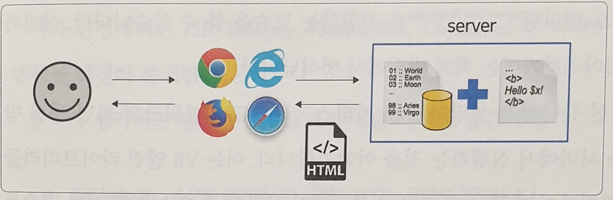
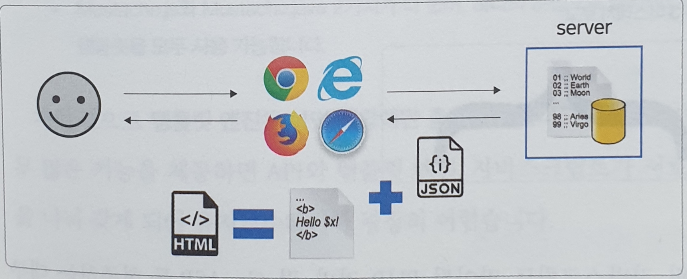

# 4장. 머스테치로 화면 구성하기
### 4.1 서버 템플릿 엔진과 머스테치 소개
#### 템플릿 엔진 : **지정된 템플릿 양식**과 **데이터**가 합쳐져 HTML 문서를 출력하는 소프트웨어
1) 서버 템플릿 엔진 : JSP, FreeMarker
- 서버에서 구동
- 서버에서 Java 코드로 문자열 생성 -> 문자열을 HTML로 변환 -> 브라우저로 전달

2) 클라이언트 템플릿 엔진 : React, View 등 뷰 파일
- 브라우저에서 화면을 생성 -> 서버에서 이미 코드가 벗어난 경우
- 서버에서 Json/Xml 형식의 데이터만 전달하고 클라이언트에서 조립

#### 머스테치
수많은 언어를 지원하는 가장 심플한 템플릿 엔진

- build.gradle에 추가 `implementation('org.springframework.boot:spring-boot-starter-mustache')`
- 파일 위치 : src/main/resources/templates
- 앞의 경로와 뒤의 파일 확장자는 자동으로 지정
  - 경로 : 파일 위치와 동일
  - 파일 확장자 : .mustache

### 4.2 게시글 등록 화면 만들기
- 페이지 로딩 속도를 높이기 위해 css는 header에, js는 footer에 두기
  (HTML은 위에서 아래로 코드 실행)
- bootstrap.js의 경우 제이쿼리에 의존하기 때문에 제이쿼리가 먼저 호출되도록 설정
